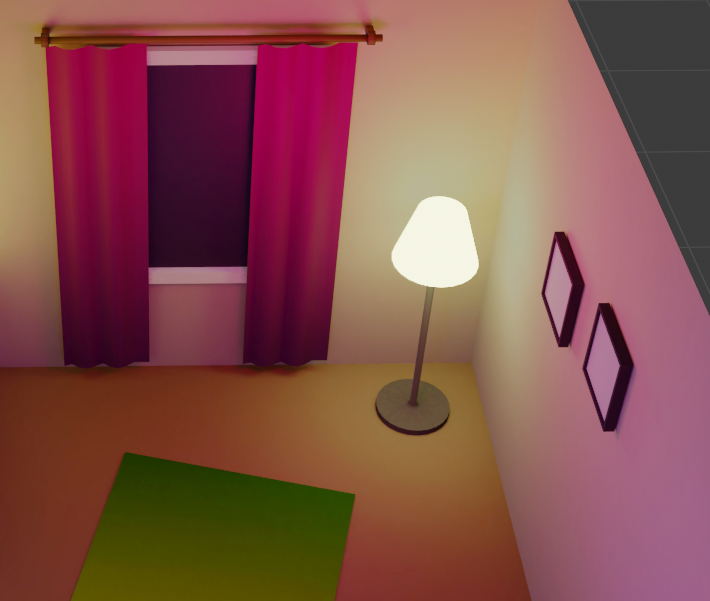
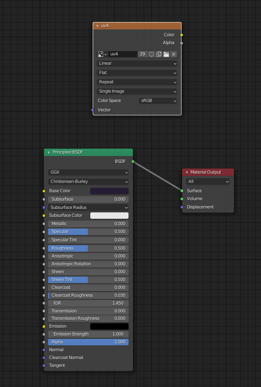
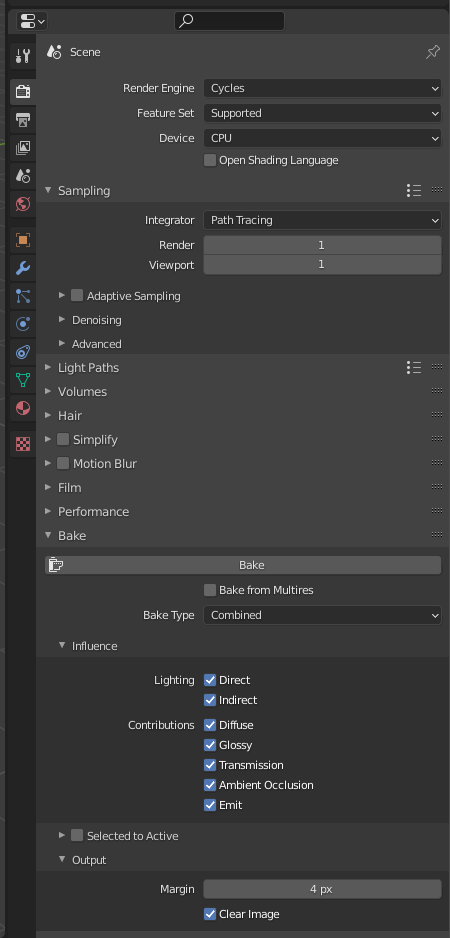

# IKEA of the future

Recently I was learning how to make this kind of beatiful scene in Three.js, utilizing light baking in Blender.

## Model preparation

Workflow was similar to how I would approach regular mid-poly scene. I didn't want to fall into low poly style, but also made sure that circular shapes like lamps won't get too heavy.

### Texturing
I started with solid colors, but later enhanced it with a technique called [Lazy Unwrapping](https://www.youtube.com/watch?v=DD84GSJiTVc). It's basically all about finding out what group of vertices should have one end of the gradient and what the other.

I used it to achieve interesting effects on larger surfaces like curtains and carpet. They are also present on table legs and bin tray, but now I think that relying on cycles lighting would be sufficient.

### Curtains

I have used `Wave` modifier as described in the [How to model realistic curtains in Blender](https://www.youtube.com/watch?v=lHIBQBSdfjA) tutorial.

### Curves

Using paths was important for achieving precision in some parts of the model. I have used similar technique to presented in [Pivot Desk Lamp](https://www.youtube.com/watch?v=q5lmw_T8Ep4) to achieve the lamp arm.

Placing lamps along the path was trickier than just using the `Curve` modifier as it would deform them. What did the trick was using instancing to place several planes along the curve and then use a mesh to place in their place while hiding them. It is well described in this [tutorial](https://www.youtube.com/watch?v=7pXcyq0gUnU).

## Concerns and glTF preparations

It took me some painful trial and error when moving from having a model to having a setup that allows light baking.

I have no idea whether those steps are fully needed, but what I found particulary useful in the process was:
1. Unlinking all linked objects and making them their own meshes.
2. Materializing curves (like lamp arm or decoration light cables).
3. Fixing normals. Blender is really forgiving in the object or even material mode about normals that go in wrong direction. Baking is not like that in any way. Broken objects were easy to identify as they turned out black or mostly black in the rendered texture.
4. I divided my scene into two collections: _Lights/emmision meshes_ and _meshes_.

What was very handy was this [tip how to turn instances to meshes](https://devtalk.blender.org/t/elegant-way-to-turn-a-collection-instance-to-a-mesh/8803/11) which helped me with the instanced lamps.

## Baking light

Baking light is possible using `Cycles` engine. The idea is to capture ray traced light in the textures and use them later to achieve amazing offline-quality lighting with the cost of rendering just the textured meshes.

Some people like to keep different diffuse (the colors) and lightmap textures, but I used the `Combined` setting and included everything in one. It also allowed me to remove all materials as they served no purpose after baking light effects into textures.

### UVs

In order to do the baking, set each material's UV maps in the following way (default one is rendered, a new, `Bake`, is selected):

### Shaders

Create a new image (for example in the UV editor mode) of size `4096x4096` with no alpha.
In shader editor add a new `Image Texture` pointing to that image. Apply for each material.

Select all meshes from the _meshes_ collection (refer to number _4_ in the list above), go to edit mode, unwrap the mesh.

I used [UVPackmaster 2](https://gumroad.com/l/uvpackmaster2) for extra quality of the UV map but that can be skipped.

### Test run

Most important time and frustration saving tip I can give based on my experience is to do a test run of the baking. This is a very wild and unintuitive (at least in the beginning) procedure and sometimes required unexplained restarts of Blender for some things to start working.

Also test run is the place to find out about all issues in the meshes and the moment when incorrect normals show up as black texture parts.

I suggest going for the lowest quality of 1 sample and maybe even smaller image like `512x512` to first try how it looks like.

You can also try increasing the sampling rate a bit to evaluate quality of textures on different objects. I have noticed really poor quality of the floor and some objects that I mitigated by scaling up their UV faces and recalculating UV packing again.

Also scaled down a lot size of invisible shapes like bottom side of the table or bottom face of the floor. It gave back some texture space that was available for scaling up walls and floor more.

### Final image and postprocessing

For the final lightmap I used `4096x4096` texture with `4px` margins (that value seems too low now as there is noticeable bleeding of black background on some objects).

Invaluable help came from this [denoising trick](https://www.youtube.com/watch?v=lJbGR0Jnd0k) that drastically improved quality of the texture (with a cost of colder lights).

## Three.js setup

TODO

## Summary

TODO
